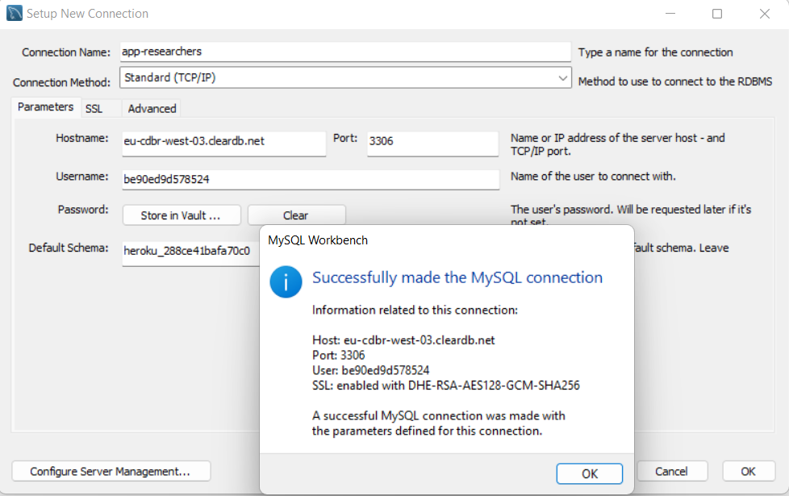

# Spring_REST_API-research-group-backend
Spring Project with JPA + H2 (Simple CRUD N:N) + ER with up to three Entities.
####
```
ENDPOINTS

Researcher

GET       /researchers
POST      /researchers
GET       /researchers/{id}
PUT       /researchers/{id}
DELETE    /researchers/{id}

Team

GET       /teams
POST      /teams
GET       /teams/{id}
PUT       /teams/{id}
DELETE    /teams/{id}

Faculty

GET       /faculties
POST      /faculties
GET	    /faculties/{id}
PUT       /faculties/{id}
DELETE    /faculties/{id}

Booking

GET       /bookings 
POST      /bookings
GET	    /bookings/{id}
PUT       /bookings/{id}
DELETE    /bookings/{id}

````
####

